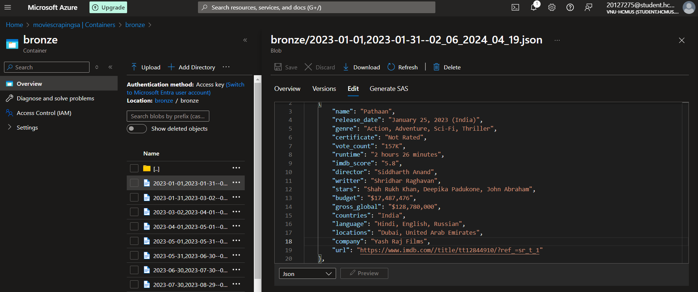
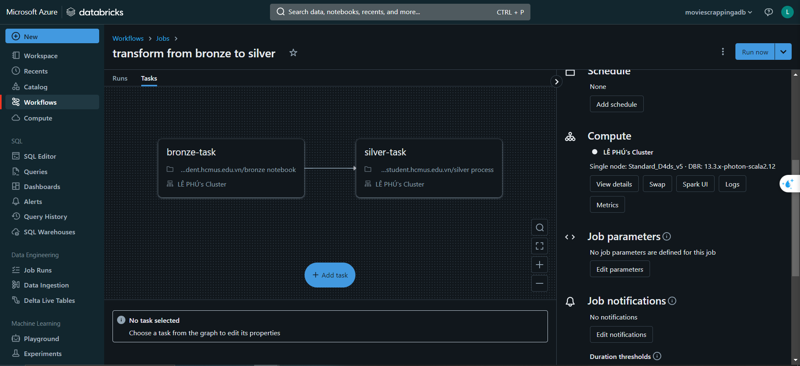
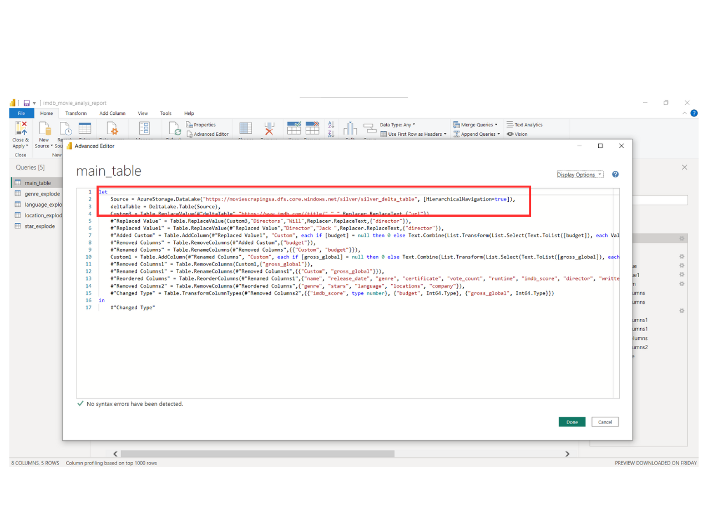
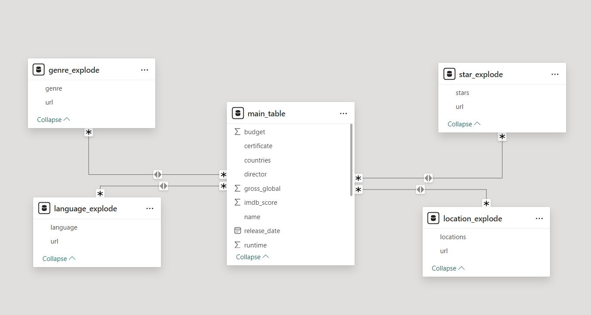
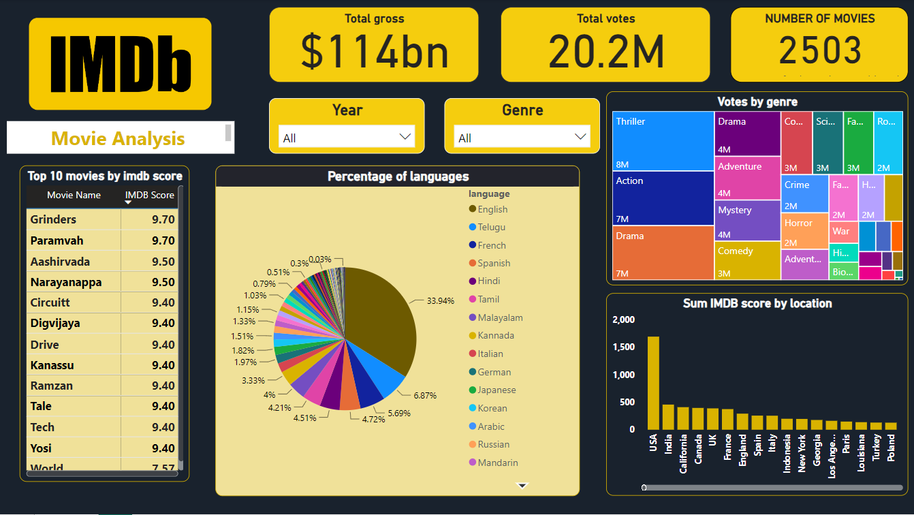
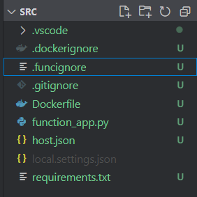

# IMDB Movie ETL - Data Engineering Project

## Table of Contents
- [Introduction](#introduction)
- [Project Overview](#project-overview)
- [Architecture](#architecture)
- [Technologies Used](#technologies-used)
- [Data Sources](#data-sources)
- [ETL Process](#etl-process)
- [Data Storage](#data-storage)
- [Data Analysis and Reporting](#data-analysis-and-reporting)
- [Setup and Installation](#setup-and-installation)
- [Usage](#usage)
- [Contributing](#contributing)
- [License](#license)
- [Contact](#contact)

## Introduction
As a passionate movie enthusiast and data engineer, I've always been fascinated by the stories behind the numbers in the film industry. Movies have the power to captivate, inspire, and move us, and I've often wondered what makes a movie successful. Is it the storyline, the cast, the director, or perhaps something less obvious? This curiosity has driven me to embark on this project to scrape IMDb movies and perform ETL (Extract, Transform, Load) processes for further analysis.

[IMDb](https://www.imdb.com/search/title/?title_type=feature&release_date={},{}&sort=num_votes,desc&count=250) is a treasure trove of information, encompassing user ratings, reviews, detailed cast and crew lists, box office figures, and more. By leveraging this data, I aim to uncover patterns and insights that can illuminate the intricacies of the film industry.

## Architecture


The architecture of this project includes:
- **Azure Function**: Scrape, extract using *selenium* and *beautifulsoup*. Then load data to Azure Datalake Gen 2
- **Azure Data Lake Storage Gen2**: Store raw/transformed data
- **Docker**: Containerize the source code folder and deploy the image to Azure Function for auto-scaling crawler
- **Spark Streaming**: Process data in micro-batches. This includes performing necessary transformations such as cleaning, filtering, and restructuring the data.
- **Azure Databricks**: Utilize Spark Streaming seamlessly integrated with Delta Lake architecture, eliminating the need for manual infrastructure setup.
- **Power BI**: Read data from Azure Datalake Gen 2 in Delta format and create intuitive and interactive visualizations


## Data Sources
- Web scraping: Extracting movies information from [IMDB websites]((https://www.imdb.com/search/title/?title_type=feature&release_date={},{}&sort=num_votes,desc&count=250) ).

## ETL Process
1. **Extraction**:

Start by trigger HTTP Azure Function, the crawler scrapes all properties's information in each page. All required parameters are: 
   - **start_date**: The minimum release date you want to scrape. All movie release dates will greater than this parameters
   - **end_date**: The maximum release date you want to scrape. All movie release dates will lesser than this parameters.
   - **nthreads**: The number of threads, each thread is a Selenium Chrome browser (i.e: if you set 3 threads, you will have 3 Selenium Chrome browser scraping concurrently)
   - **limit_each_month**: The number of movies in a month. Because IMBb website show all movies in one page, to manage the large volume of movies listed on the IMDb website, the process is divided into multiple months to prevent overwhelming the system with data from a single page.
   
   Raw data upload to `Bronze` container in ADLS in json format



2. **Transformation**:

Run azure databricks notebook job to do following tasks: (1) create **Bronze Delta Table** for data in `bronze` container. (2) Transformed into `silver` container in **Silver Delta Table**.

*I lend my friend's free azure account so the cluster is not my name*

3. **Loading**:

Transformed data in `silver` container is loaded into the PowerBI
 

## Data Analysis and Reporting
- After the ETL process, the data is analyzed to generate meaningful insights.
- In powerBI model, i opted for the One Big Table (OBT) approach for this project due to the dataset's simplicity and limited number of attributes. Some attributes have type list (i.e: genre attribute have example value "Action, Thriller, Honor"), so i am explode it to multiple rows and use `url` as foreign key.



## Setup and Installation

### Install the Azure Functions Core Tools

Following instruction [here](https://learn.microsoft.com/en-us/azure/azure-functions/functions-run-local?tabs=windows%2Cisolated-process%2Cnode-v4%2Cpython-v2%2Chttp-trigger%2Ccontainer-apps&pivots=programming-language-csharp)

### Create Azure Function local project

```bash
func init --worker-runtime python --docker -m V2
```

Once you run the command, your file structure will look something like
<p align="center">

</p>


Create a Python virtual environment and activate it. I am using python3.11

```bash
python -m venv .venv && source .venv/bin/activate
```

