# IMDB Movie ETL - Data Engineering Project

## Table of Contents
- [Introduction](#introduction)
- [Architecture](#architecture)
- [Technologies Used](#technologies-used)
- [Data Sources](#data-sources)
- [ETL Process](#etl-process)
- [Data Analysis and Reporting](#data-analysis-and-reporting)
- [Setup and Installation](#setup-and-installation)

## Introduction
As a passionate movie enthusiast and data engineer, I've always been fascinated by the stories behind the numbers in the film industry. Movies have the power to captivate, inspire, and move us, and I've often wondered what makes a movie successful. Is it the storyline, the cast, the director, or perhaps something less obvious? This curiosity has driven me to embark on this project to scrape IMDb movies and perform ETL (Extract, Transform, Load) processes for further analysis.

[IMDb](https://www.imdb.com/search/title/?title_type=feature&release_date={},{}&sort=num_votes,desc&count=250) is a treasure trove of information, encompassing user ratings, reviews, detailed cast and crew lists, box office figures, and more. By leveraging this data, I aim to uncover patterns and insights that can illuminate the intricacies of the film industry.

## Architecture


The architecture of this project includes:
- **Azure Function**: Scrape, extract using *selenium* and *beautifulsoup*. Then load data to Azure Datalake Gen 2
- **Azure Data Lake Storage Gen2**: Store raw/transformed data
- **Docker**: Containerize the source code folder and deploy the image to Azure Function for auto-scaling crawler
- **Spark Streaming**: Process data in micro-batches. This includes performing necessary transformations such as cleaning, filtering, and restructuring the data.
- **Azure Databricks**: Utilize Spark Streaming seamlessly integrated with Delta Lake architecture, eliminating the need for manual infrastructure setup.
- **Power BI**: Read data from Azure Datalake Gen 2 in Delta format and create intuitive and interactive visualizations


## Data Sources
- Web scraping: Extracting movies information from [IMDB websites]((https://www.imdb.com/search/title/?title_type=feature&release_date={},{}&sort=num_votes,desc&count=250) ).

## ETL Process
1. **Extraction**:

Start by trigger HTTP Azure Function, the crawler scrapes all properties's information in each page. All required parameters are: 
   - **start_date**: The minimum release date you want to scrape. All movie release dates will greater than this parameters
   - **end_date**: The maximum release date you want to scrape. All movie release dates will lesser than this parameters.
   - **nthreads**: The number of threads, each thread is a Selenium Chrome browser (i.e: if you set 3 threads, you will have 3 Selenium Chrome browser scraping concurrently)
   - **limit_each_month**: The number of movies in a month. Because IMBb website show all movies in one page, to manage the large volume of movies listed on the IMDb website, the process is divided into multiple months to prevent overwhelming the system with data from a single page.
   
   Raw data upload to `Bronze` container in ADLS in json format


2. **Transformation**:

Run azure databricks notebook job to do following tasks: (1) create **Bronze Delta Table** for data in `bronze` container. (2) Transformed into `silver` container in **Silver Delta Table**.

*I lend my friend's free azure account so the cluster is not my name*

3. **Loading**:

Transformed data in `silver` container is loaded into the PowerBI
 

## Data Analysis and Reporting
- After the ETL process, the data is analyzed to generate meaningful insights.
- In powerBI model, i opted for the One Big Table (OBT) approach for this project due to the dataset's simplicity and limited number of attributes. Some attributes have type list (i.e: genre attribute have example value "Action, Thriller, Honor"), so i am explode it to multiple rows and use `url` as foreign key.


## Setup and Installation

### Install the Azure Functions Core Tools

Following instruction [here](https://learn.microsoft.com/en-us/azure/azure-functions/functions-run-local?tabs=windows%2Cisolated-process%2Cnode-v4%2Cpython-v2%2Chttp-trigger%2Ccontainer-apps&pivots=programming-language-csharp)

### Create Azure Function local project

Clone this project
```bash
git clone https://github.com/TrungTechh/IMDBMovieETL.git
```

Create a Python virtual environment and activate it. I am using python3.11

```bash
python -m venv .venv 
./.venv/Scripts/activate
```

Install the dependencies by running pip instal

```
pip install -r requirements.txt
```

### Set up ADLS and ACR

Create two containers named `bronze` and `silver` in your Azure Storage account

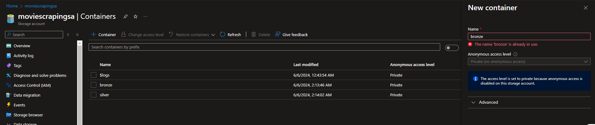

Create `.env` file to store these environment variables

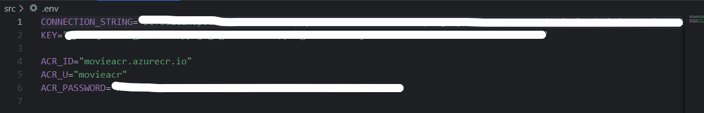

- In your storage account portal, navigate to **Security + networking** > **Access keys** to get **CONNECTION_STRING** and **KEY**
- After creating Azure Container Registry. Go to the newly created resource > **Access Keys**, and click the checkbox “Admin User” to allow logging in through username & password. Copy your ACR login server name, username, and password from here.

### Testing in local

Start the function app
```bash
func start
```

You’d see the following output

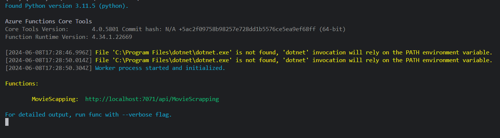

Paste the http://localhost:7071/api/MovieScrapping to your web browser or Postman. Pass the parameter if needed. It took me more than 8 hours to scrape all movies from *2023-01-01* to *2023-10-01* with 500 movies each month. 

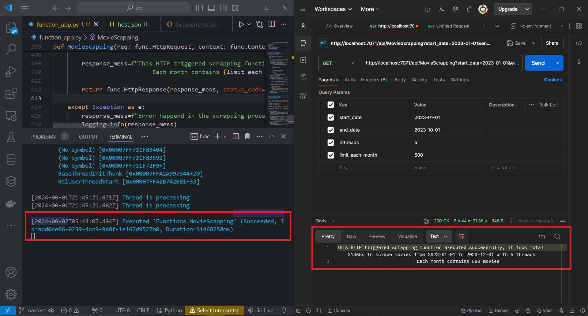

Go to `bronze` container created previous before you will see our data store in multiple json files.

### Deploying to ACR using Shell Script

Run this file from terminal. Replace `image_name` with yours

```
./build_docker.sh
```

Wait for the process to complete. Once completed, head over to your ACR, and click Repositories. You’ll see your newly created repository over there.

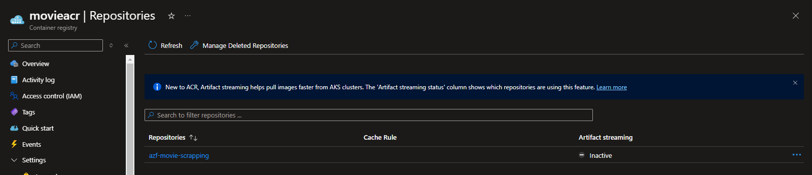

### Deploy to Azure Functions App

From **azure portal** > **Function App** and choose **Container Apps environment**

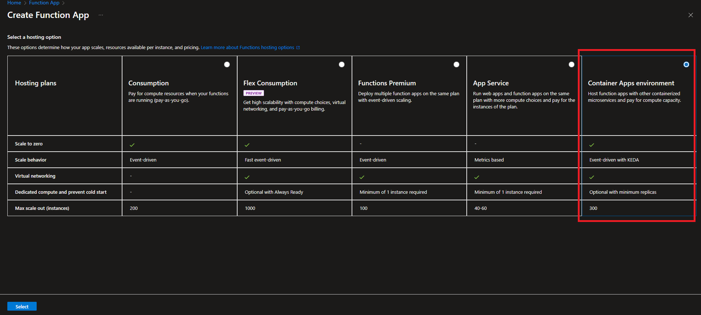

Fill in the necessary details. Navigate to **Deployment** header tag, in **Image type** click **Private**. Choose Container Image as the deployment method and other authentication information.

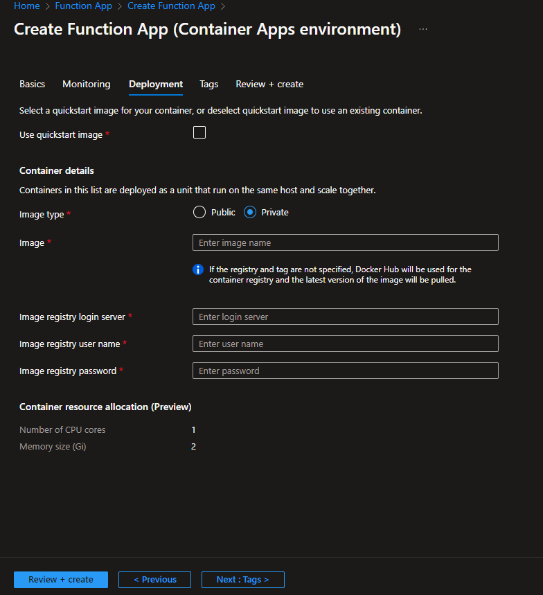

Once created, head over to the Function App and copy the app url. Try hitting the page `FunctionAppBaseUrl`/api/MovieScrapping?start_date=2023-01-01&end_date=2023-01-15&nthreads=1&limit_each_month=1 and it should work.

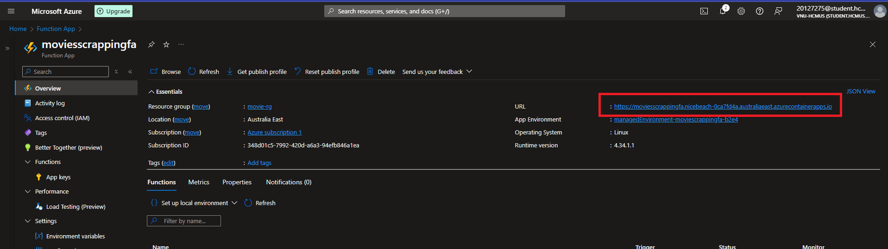
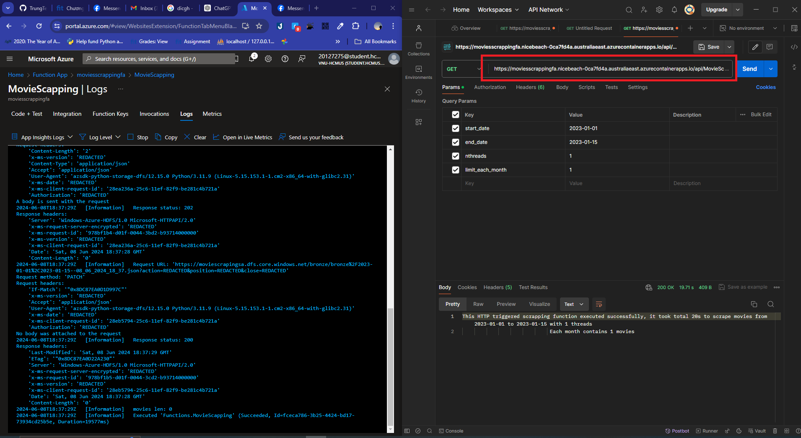

### Set up Databricks

Upload three notebook files in `/adb_notebook` folder: `bronze_process`, `silver_process` and `pipeline_function` to Azure Databricks workspace

- `pipeline_function`: Determines all function need to implement pipeline
- `bronze_process`: Use function in `pipeline_function` to read data in `bronze` container and store in delta format.
- `silver_process`: Use function in `pipeline_function` to read delta table in `bronze` container and transform into `silver` container.

Create task with notebook type as below. Change the value of parameter `trigger` to streaming type if you want.

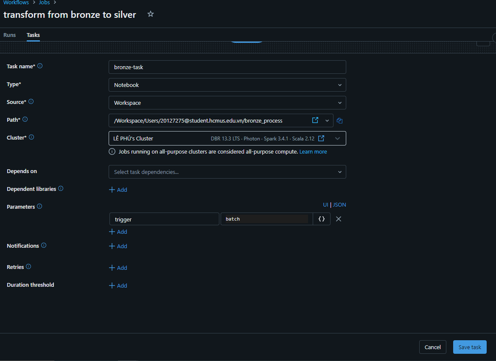

Do samething with `silver_process`. Finally, run the job.

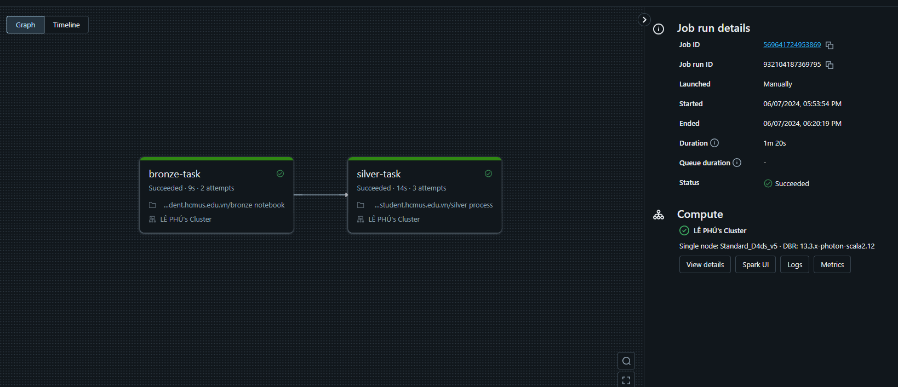
